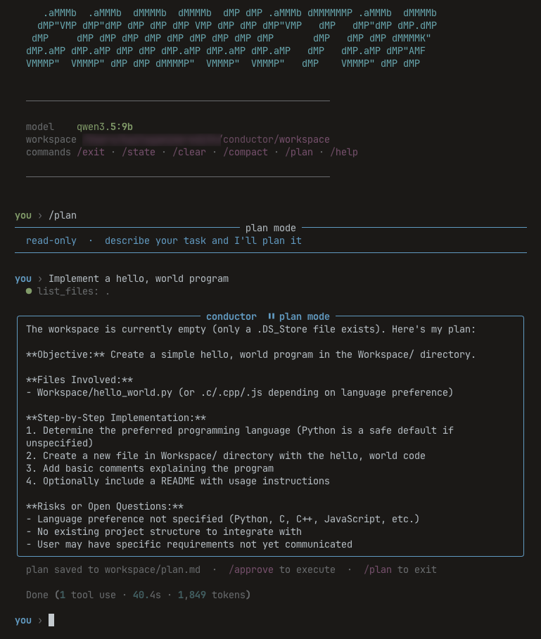

# Conductor

### A Local Agentic Harness for Qwen3



[](https://www.python.org/downloads/)
[](https://opensource.org/licenses/MIT)
[](https://ollama.com/)
[](https://qwenlm.github.io/)

Conductor is a lightweight, command-line harness that transforms local models (optimized for Qwen3 via Ollama) into capable, autonomous agents using a ReAct loop. Built as an experiment to test the upper bound of local inference on consumer hardware.

> **Hardware context:** Built, constrained, and tested on a **2021 MacBook Pro (M1, 16GB RAM)**. Agentic workflows including web search, RAG, file manipulation, and voice input run entirely on-device with no cloud APIs.

---

## Architecture

```
┌─────────────────────────────────────────────────────────┐
│                      User Input                         │
└──────────────────────┬──────────────────────────────────┘
                       │
                       ▼
              ┌────────────────┐
              │  Fast-Path     │── match ──▶ Direct tool execution
              │  Router        │            (0 LLM calls, <1s)
              └───────┬────────┘
                      │ no match
                      ▼
              ┌────────────────┐
              │  Slash Command │── /plan, /approve, /compact, etc.
              │  Dispatch      │   (deterministic, no LLM)
              └───────┬────────┘
                      │ not a command
                      ▼
         ┌────────────────────────┐
         │     ReAct Loop         │
         │  ┌──────────────────┐  │
         │  │ System Prompt    │  │◀─── Full prompt (step 1)
         │  │ + State + Tools  │  │◀─── Compressed prompt (step 2+)
         │  └───────┬──────────┘  │
         │          ▼             │
         │  ┌──────────────────┐  │
         │  │ LLM Inference    │  │──── thinking_budget: 512 (step 1)
         │  │ (Ollama/Qwen3)   │  │──── thinking_budget: 128 (step 2+)
         │  └───────┬──────────┘  │
         │          ▼             │
         │  ┌──────────────────┐  │
         │  │ Tool Extraction  │  │──── JSON or XML fallback
         │  │ + Execution      │  │
         │  └───────┬──────────┘  │
         │          │             │
         │          ▼             │
         │    Observation ────────│──▶ Loop (max 8 steps)
         └────────────────────────┘
                      │
                      ▼
         ┌────────────────────────┐
         │  State Update          │──── <UPDATE_STATE> extraction
         │  + Transcript Append   │──── conductor_transcript.jsonl
         └────────────────────────┘
```

---

## Features

### Core

| Feature | Description |
|---|---|
| **ReAct loop** | Alternating thought → tool → observation, capped at 8 steps per turn |
| **Workspace sandboxing** | All file ops confined to `./workspace` (+ optional Obsidian vault) |
| **Progressive context loading** | Full system prompt on step 1; compressed ~40-token prompt on continuations |
| **Fast-path routing** | Pattern-matches obvious intents (`navigate to`, `open`, `read`, `create`, `list`) and routes directly to tools with zero LLM calls |
| **Multi-instruction detection** | Compound requests ("do X. then do Y") bypass fast-path and go to the LLM |
| **Bias to action** | System prompt instructs the model to act on reversible operations, not ask |

### Tools

| Tool | Description |
|---|---|
| `read_file` | Read files from workspace or vault. Supports PDF extraction via `pdfplumber`/`pypdf` |
| `write_file` | Write files with diff preview and approval prompt (`y` / `a` approve all / `n`) |
| `list_files` | List directory contents |
| `fetch_url` | Fetch and extract text from a URL, with optional RAG-based chunk retrieval |
| `web_search` | Search the web via DuckDuckGo. Returns top results with titles and snippets. No API key required |
| `run_command` | Execute allowlisted shell commands: `obsidian`, `git`, `ls`, `pwd`, `echo`, `ps`, `df`, `date`, `python3`. Blocks `python3 -c` |
| `done` | Signal task completion |

### Modes

```
   /plan                        /approve
────────▶  Plan Mode  ─────────────────▶  Execute Mode
          (read-only)                     (step-by-step)
              │                                │
              │  Four phases:                   │  Runs the plan from
              │  1. Explore                     │  workspace/plan.md
              │  2. Analyze                     │  using all tools
              │  3. Plan                        │
              │  4. Signal (<PLAN_READY/>)       │
              │                                │
   /plan  ◀───┘                    ◀───────────┘
          (back to default)        (auto-returns to default)
```

- **Default** — Conversational. Full tool access. Immediate action.
- **Plan** (`/plan`) — Read-only exploration. Produces a structured Markdown plan saved to `workspace/plan.md`. No writes permitted.
- **Execute** (`/approve`) — Executes the saved plan step-by-step with full tool access.

### Memory & State

```
state.md                    (thin index → context files)
  │
  ├── context/user.md       (name, vault path, city, preferences)
  ├── context/objectives.md (session goals, updated via <UPDATE_STATE>)
  └── context/environment.md (date, time, timezone, weather — refreshed on boot)
```

- All context files loaded into the system prompt each turn via `read_state()`
- Targeted updates: `<UPDATE_STATE file="user.md">` writes to a specific context file
- **Session consolidation** on exit (after 2+ turns): LLM pass deduplicates, prunes stale objectives, resolves contradictions

### Voice Input

| Method | How |
|---|---|
| **Push-to-talk** | Hold right `⌥` (Option) to record, release to transcribe and send |
| **Manual** (`/mic`) | Starts recording immediately; press Enter to stop and transcribe |

Transcription uses `mlx-whisper` (on-device, Apple Silicon optimized). PTT requires macOS Accessibility permission for your terminal app. If STT dependencies aren't installed, the PTT listener doesn't start — no spurious error messages on accidental keypresses.

### UX

- **ESC interrupt** — Cancel a running turn mid-stream. Turn is discarded, prompt returns immediately.
- **Thinking throbber** — Live `* Thinking... (Xs)` elapsed timer on stderr during inference.
- **Tool status dots** — Grey dot on start → green on completion. Chained calls indented with `└`. Collapsed after 3 with `+N more tool uses`.
- **Write diffs** — Line-level diff with green/red highlights before every file write.
- **Session summary** — On `/exit`: turns, tool calls, total tokens, elapsed time.
- **Context compaction** (`/compact`) — Compresses conversation history into a dense summary. Accepts optional focus: `/compact keep the file paths`.

---

## Qwen3 Optimizations

- `<think>` tokens stripped from assistant history to save context space
- `/no_think` appended on tool-execution turns to suppress unnecessary reasoning
- Thinking budget capped at 512 tokens (step 1) and 128 tokens (continuation steps)
- Continuation turns use a compressed system prompt (~40 tokens) instead of the full schema (~600 tokens)

---

## Getting Started

### Prerequisites

- Python 3.8+
- [Ollama](https://ollama.com/) running locally
- Qwen3 model pulled:
  ```bash
  ollama pull qwen3.5:9b
  ```

### Install

```bash
# Core
pip install httpx beautifulsoup4 pydantic rich ollama

# Optional: PDF parsing + semantic retrieval
pip install pdfplumber pypdf sentence-transformers

# Optional: voice input (push-to-talk + /mic)
pip install mlx-whisper sounddevice pynput
```

> **macOS PTT:** Grant Accessibility permission to your terminal — System Settings → Privacy & Security → Accessibility.

### Run

```bash
python conductor.py
```

First launch walks through onboarding: name, Obsidian vault path, city (for weather). All fields optional.

---

## Commands

| Command | Description |
|---|---|
| `/plan` | Toggle plan mode (read-only) |
| `/approve` | Execute `workspace/plan.md` |
| `/state` | View current memory |
| `/compact [focus]` | Compress conversation history |
| `/mic` | Manual voice input (record → Enter → transcribe) |
| `/clear` | Clear conversation history |
| `/help` | Show commands |
| `/exit`, `/quit` | Consolidate memory + exit with session summary |

---

## Security

- **Workspace sandbox** — file operations blocked outside `./workspace` and configured vault
- **Allowlisted commands** — `run_command` only permits a fixed set; `python3 -c` explicitly blocked
- **Untrusted content delimiters** — `fetch_url` and `web_search` results wrapped with injection-mitigation markers per OWASP LLM Top 10
- **Path traversal guard** — all paths resolved and checked against allowed roots before any I/O
- **Empty path guard** — `read_file` and `write_file` reject empty/null paths before resolution

## Research Basis

- **ReAct pattern** — Yao et al. 2022
- **Prompt injection defense** — OWASP LLM Top 10 2025, arxiv 2601.04795
- **RAG chunking** — 400-word chunks, 50-word overlap; `multi-qa-mpnet-base-dot-v1` embeddings
- **Fast-path routing** — inspired by Claude Code's deterministic dispatch for slash commands and obvious intents
- **Progressive context loading** — compressed continuation prompts, inspired by production agent harness patterns
- **Step budget cap** — IBM/LangChain consensus: 5-10 max iterations
